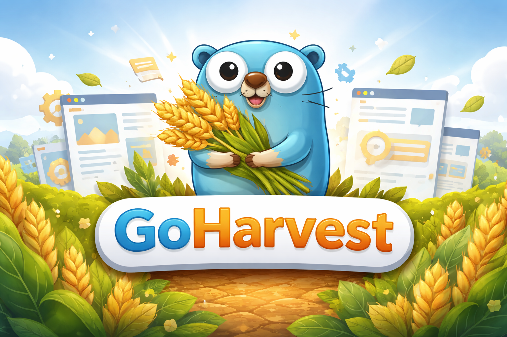

# GoHarvest 🚜



**GoHarvest** is a powerful, flexible, and easy-to-use web scraping library written in Go. It enables developers to extract data from websites efficiently, supporting both static and dynamic content through headless browser automation.

## Table of Contents
- [Features](#features)
- [Installation](#installation)
- [Quick Start](#quick-start)
- [Advanced Usage](#advanced-usage)
- [API Reference](#api-reference)
- [Examples](#examples)
- [Contributing](#contributing)
- [License](#license)

## Features

- ✅ **Generic Scraping**: Leverages Go generics for type-safe data extraction
- ✅ **Headless Browser Support**: Integrates with Chromium via chromedp for JavaScript-heavy sites
- ✅ **Flexible Data Extraction**: Configurable selectors with CSS queries, attributes, and custom extraction functions
- ✅ **Advanced Scraping Actions**: Supports pre-scraping actions like clicks, scrolls, and waits
- ✅ **Link Discovery**: Automatic discovery and scraping of linked pages based on CSS selectors
- ✅ **Cookie Management**: Support for setting custom cookies for authenticated or personalized scraping
- ✅ **Concurrent Processing**: Configurable concurrent requests with rate limiting
- ✅ **Streaming Results**: Channel-based streaming of results for memory-efficient processing
- ✅ **Rate Limiting**: Built-in request delay controls to be respectful to target servers

## Installation

To use GoHarvest in your project, simply add it as a dependency:

```bash
go mod init your-project-name
go get github.com/Djancyp/goharvest
```

### Prerequisites

- Go 1.24.0 or higher
- Chromium browser installed on the system (for headless browser functionality)

## Quick Start

Here's a simple example to get you started with GoHarvest:

```go
package main

import (
    "fmt"
    "time"

    "github.com/Djancyp/goharvest"
)

type Product struct {
    Title string `json:"title"`
    Price string `json:"price"`
    Image string `json:"image"`
}

func main() {
    scraper := &goharvest.Scrapper[Product]{
        Urls: []string{"https://example.com/products"},
        Selectors: []goharvest.Selector{
            {
                Name:  "Title",
                Query: "h1.product-title",
            },
            {
                Name:  "Price",
                Query: ".price",
            },
            {
                Name:  "Image",
                Query: "img.product-image",
                Attr:  "src",
            },
        },
        RequestDelay: 1 * time.Second,
    }

    results, err := scraper.Scrape()
    if err != nil {
        panic(err)
    }

    for _, product := range results {
        fmt.Printf("Product: %+v\n", product)
    }
}
```

## Advanced Usage

### Using Pre-Scraping Actions

For JavaScript-heavy sites or when you need to perform actions before scraping:

```go
scraper := &goharvest.Scrupper[Product]{
    Urls: []string{"https://example.com"},
    PreScrapeActions: []goharvest.PreScrapeAction{
        {
            Type:     goharvest.ClickAction,
            Selector: "#load-more-button",
            WaitUntil: ".new-content-loaded",
        },
        {
            Type:     goharvest.ScrollAction,
            Selector: ".scroll-target",
        },
        {
            Type:     goharvest.WaitAction,
            Duration: 2 * time.Second,
        },
    },
    Selectors: []goharvest.Selector{
        {
            Name:  "Title",
            Query: "h1.title",
        },
        {
            Name:  "Content",
            Query: ".content",
        },
    },
}
```

### Working with Arrays

Extract multiple values for a single field:

```go
type Article struct {
    Headings []string `json:"headings"`
    Links    []string `json:"links"`
}

scraper := &goharvest.Scrapper[Article]{
    Urls: []string{"https://example.com/article"},
    Selectors: []goharvest.Selector{
        {
            Name:    "Headings",
            Query:   "h2, h3",
            IsArray: true,
        },
        {
            Name:    "Links",
            Query:   "a[href]",
            Attr:    "href",
            IsArray: true,
        },
    },
}
```

### Custom Extraction Functions

Define custom functions for complex data extraction:

```go
var ExtractPrice = func(sel *goquery.Selection) string {
    text := sel.Text()
    // Remove currency symbols and extra whitespace
    return strings.TrimSpace(strings.Replace(text, "$", "", -1))
}

scraper := &goharvest.Scrapper[Product]{
    Urls: []string{"https://example.com/products"},
    Selectors: []goharvest.Selector{
        {
            Name:        "Price",
            Query:       ".price",
            ExtractFunc: ExtractPrice,
        },
    },
}
```

### Cookie Management

Set custom cookies for authenticated scraping:

```go
scraper := &goharvest.Scrapper[Data]{
    Urls: []string{"https://example.com/protected-page"},
    Cookies: []map[string]string{
        {
            "name":  "session_id",
            "value": "abc123",
        },
        {
            "name":  "auth_token",
            "value": "xyz789",
        },
    },
    Selectors: []goharvest.Selector{
        // ... your selectors
    },
}
```

### Streaming Results

For memory-efficient processing of large datasets:

```go
scraper := &goharvest.Scrapper[Product]{
    Urls: []string{"https://example.com/products"},
    Selectors: []goharvest.Selector{
        // ... your selectors
    },
}

streamChan, err := scraper.ScrapeStream()
if err != nil {
    panic(err)
}

for result := range streamChan {
    fmt.Printf("Received product: %+v\n", result)
    // Process each result as it arrives
}
```

## API Reference

### `Scrapper[T]` Struct

The main scraper struct that handles the scraping process for type `T`.

#### Fields

- `Urls []string`: List of URLs to scrape
- `RequestDelay time.Duration`: Time to wait between requests
- `Timeout time.Duration`: Request timeout duration
- `RobotsTxtDisabled bool`: Whether to ignore robots.txt rules
- `LogDisabled bool`: Whether to disable logging
- `ConcurrentRequests int`: Number of concurrent requests allowed
- `ConcurrentRequestsPerDomain int`: Concurrent requests per domain
- `UserAgent string`: Custom user agent string
- `Cookies []map[string]string`: Custom cookies to be sent with requests
- `Selectors []Selector`: List of selectors to extract data
- `ParseFunc func(*goquery.Document) T`: Optional custom parser function
- `LinkHunt string`: CSS selector for automatic link discovery
- `EachEvent func(T)`: Callback function called for each scraped item
- `PreScrapeActions []PreScrapeAction`: Actions to perform before scraping

### `Selector` Struct

Defines how to extract data from HTML elements.

#### Fields

- `Name string`: Struct field name or map key
- `Query string`: CSS selector query
- `Attr string`: Attribute to extract (e.g., "src", "href", or empty for text content)
- `IsArray bool`: Whether to extract multiple values as an array
- `ExtractFunc ExtractionFunc`: Function to extract data from selection

### `PreScrapeAction` Struct

Represents an action to be performed before scraping.

#### Fields

- `Type PreScrapeActionType`: Type of action to perform (ClickAction, ScrollAction, WaitAction)
- `Selector string`: CSS selector for the element to act on
- `Duration time.Duration`: Duration for wait actions
- `WaitUntil string`: Selector to wait for after action (optional)

### `ExtractionFunc` Type

A function that takes a `*goquery.Selection` and returns a string.

#### Built-in Extraction Functions

- `Text`: Extracts all text content from matching elements
- `FirstText`: Extracts text content only from the first matching element
- `HTML`: Extracts the HTML content from matching elements
- `Attr(attrName string)`: Extracts attribute value from matching elements

### Methods

#### `Scrape() ([]T, error)`

Performs the scraping and returns all results as a slice. Maintains backward compatibility by collecting all results before returning.

#### `ScrapeStream() (<-chan T, error)`

Starts scraping and returns a channel that will receive results as they are scraped. Useful for memory-efficient processing of large datasets.

## Examples

### Example 1: Scraping News Articles

```go
package main

import (
    "fmt"
    "time"
    
    "github.com/Djancyp/goharvest/pkg"
)

type NewsArticle struct {
    Title       string   `json:"title"`
    Author      string   `json:"author"`
    PublishDate string   `json:"publish_date"`
    Content     string   `json:"content"`
    Tags        []string `json:"tags"`
}

func main() {
    scraper := &goharvest.Scrapper[NewsArticle]{
        Urls: []string{"https://news-site.com/latest"},
        Selectors: []goharvest.Selector{
            {
                Name:  "Title",
                Query: "h1.article-title",
            },
            {
                Name:  "Author",
                Query: ".author-name",
            },
            {
                Name:  "PublishDate",
                Query: ".publish-date",
            },
            {
                Name:  "Content",
                Query: ".article-body",
            },
            {
                Name:    "Tags",
                Query:   ".tag",
                IsArray: true,
            },
        },
        RequestDelay: 2 * time.Second,
    }
    
    articles, err := scraper.Scrape()
    if err != nil {
        panic(err)
    }
    
    for _, article := range articles {
        fmt.Printf("Article: %+v\n", article)
    }
}
```

### Example 2: E-commerce Product Scraping

```go
package main

import (
    "fmt"
    "strings"
    "time"

    "github.com/PuerkitoBio/goquery"
    "github.com/Djancyp/goharvest"
)

type Product struct {
    Name        string   `json:"name"`
    Price       string   `json:"price"`
    Description string   `json:"description"`
    Images      []string `json:"images"`
    Rating      string   `json:"rating"`
}

var ExtractPrice = func(sel *goquery.Selection) string {
    text := sel.Text()
    // Remove currency symbols and extra whitespace
    return strings.TrimSpace(strings.Replace(text, "$", "", -1))
}

func main() {
    scraper := &goharvest.Scrapper[Product]{
        Urls: []string{"https://shop.example.com/category/electronics"},
        Selectors: []goharvest.Selector{
            {
                Name:  "Name",
                Query: ".product-name",
            },
            {
                Name:        "Price",
                Query:       ".price-current",
                ExtractFunc: ExtractPrice,
            },
            {
                Name:  "Description",
                Query: ".product-description",
            },
            {
                Name:    "Images",
                Query:   ".product-gallery img",
                Attr:    "src",
                IsArray: true,
            },
            {
                Name:  "Rating",
                Query: ".rating-value",
            },
        },
        RequestDelay: 1 * time.Second,
        LinkHunt:     ".product-link", // Automatically follow product links
    }
    
    products, err := scraper.Scrape()
    if err != nil {
        panic(err)
    }
    
    for _, product := range products {
        fmt.Printf("Product: %+v\n", product)
    }
}
```

## Contributing

We welcome contributions to GoHarvest! Here's how you can help:

### Reporting Issues

- Use the GitHub issue tracker to report bugs
- Describe the problem in detail with steps to reproduce
- Include your Go version, OS, and any relevant error messages

### Pull Requests

1. Fork the repository
2. Create a new branch (`git checkout -b feature/amazing-feature`)
3. Make your changes
4. Add tests if applicable
5. Commit your changes (`git commit -am 'Add amazing feature'`)
6. Push to the branch (`git push origin feature/amazing-feature`)
7. Create a new Pull Request

### Development Setup

1. Clone the repository:
   ```bash
   git clone https://github.com/Djancyp/goharvest.git
   cd goharvest
   ```

2. Install dependencies:
   ```bash
   go mod download
   ```

3. Run tests (if available):
   ```bash
   go test ./...
   ```

### Code Style

- Follow Go's official formatting guidelines (`go fmt`)
- Write clear, descriptive comments
- Add tests for new functionality
- Keep pull requests focused on a single feature or bug fix

## License

This project is licensed under the MIT License - see the [LICENSE](LICENSE) file for details.

## Acknowledgments

- Built with [chromedp](https://github.com/chromedp/chromedp) for headless browser automation
- Uses [goquery](https://github.com/PuerkitoBio/goquery) for HTML manipulation
- Powered by [geziyor](https://github.com/geziyor/geziyor) for HTTP requests
